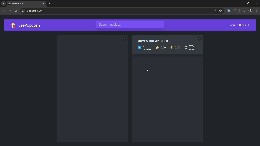

# usePopcorn

**usePopcorn** is a React application that fetches movie data from an API and displays it to the user based on search queries. Users can rate movies, add them to their watched list, and remove them, all within an organized and aesthetically pleasing user interface.

## Features

- **Search Movies**: Search for movies by title and view relevant results.
- **Rate Movies**: Users can rate movies and see their ratings.
- **Watched List**: Add movies to a watched list and remove them as needed.
- **User Interface**: Clean and responsive UI designed with CSS.

## Technologies Used

- **React**: JavaScript library for building user interfaces.
- **CSS**: For styling the components.
- **API**: Fetch movie data from a third-party API.

## Demo



## Installation

1. **Clone the repository**:
    ```bash
    git clone https://github.com/your-username/usePopcorn.git
    ```
2. **Navigate to the project directory**:
    ```bash
    cd usePopcorn
    ```
3. **Install dependencies**:
    ```bash
    npm install
    ```
4. **Start the development server**:
    ```bash
    npm start
    ```

## Usage

1. Open your browser and go to `http://localhost:3000`.
2. Use the search bar to look for movies by their titles.
3. Rate movies and add them to your watched list.
4. View your watched list and manage your movies.

## API Integration

The app fetches movie data from a third-party API. Ensure you have the API key set up in your environment variables:

```bash
REACT_APP_API_KEY=your_api_key_here
